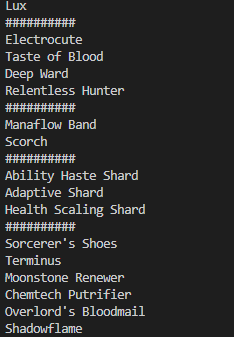

# Ultimate Bravery Tool

## Main aims
The aim of this program is to be able to create a random rune build, item build and champion selection for a game of League of Legends.

For this program to be successful a list of all runes, items and champions must be stored, then generate a rune build (with all minor runes matching the keystone selected), items will be randomly selected and displayed (all items must be buildable on that champ) and a random champion chosen.

## What I will learn
I will learn how to store large amounts of data and how to randomly access indexes efficiently and how to make selections truely random and stop duplicate selections as much as I can. 

I will also be doing this project in Python as this is a language I have hardly touched and want to gain some experience in.

## Initial thoughts
I will most likely use maps or dictionaries (or both) to store the data for champs, runes and items. I will then need to check for character status such as melee/ranged and for Cassiopea to not buy boots.

I think I will struggle with the Python syntax and workflow but this is to be expected when working with a new language.

## Time spent on project
- 1 hour - Added rune selection functionality and displaying.
- 2 hours - Fully functional prototype and displays a full build, coherent rune page and a champion choice. Going forward I could make `champions` a class and add variables such as ranged or melee and if they can buy boots.

## Screenshots
### First prototype at hour 2

